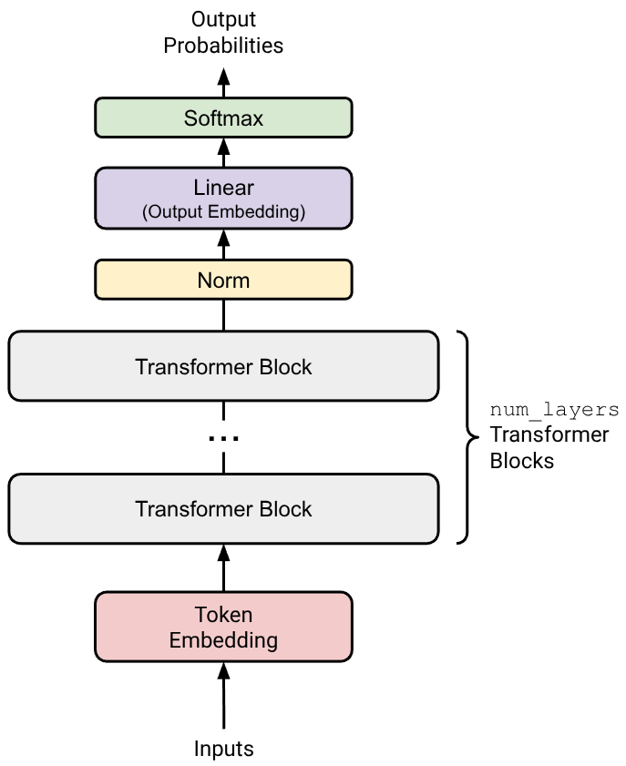
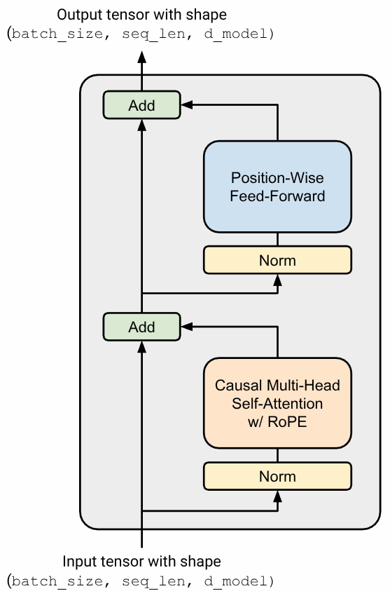
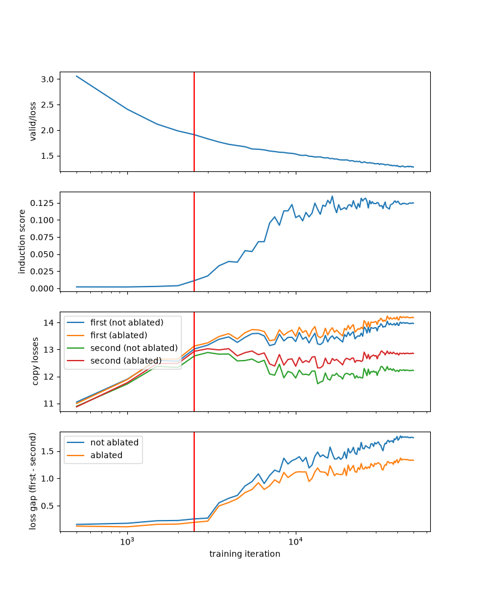

# Building a Transformer from scratch

## Preface

This write-up documents a self-directed project: building and training a Transformer from scratch, then using basic interpretability techniques to investigate what it learnt. It is my first sustained attempt to understand how language models work and my introduction to mechanistic interpretability.

I followed [Stanford CS336: Language Modelling from Scratch Assignment 1](https://github.com/stanford-cs336/assignment1-basics/tree/main) for the structure of the project. It breaks the model down into components that are combined at the end and provides tests for checking their behaviour. I wrote the implementation myself. The [README](README.md) explains how to run it.

### AI usage disclaimer

I used GPT 6 Astra, Claude Fable 5, and Opus 5 to assist in this project. The [AGENTS.md](AGENTS.md) in this repository (taken from CS336's course materials) explicitly forbids LLMs from writing code for me and instructs them to enhance, not supplant, my learning. All programming was done by hand, and I frequently asked LLMs to clarify concepts I did not understand well or to point me in the right direction for debugging. I also asked LLMs to do tedious tasks like writing commit messages. I used LLMs to help draft and edit the README and this write-up from my drafts and development conversations.

## Architecture

The diagrams below give an overview of the model and the components of one Transformer block.

| An overview of the model | One Transformer block |
| :---: | :---: |
|  |  |

Compared with the original Transformer, this model has five main architectural differences:

1. Decoder-only architecture. The model predicts the next token from the preceding tokens.
2. Pre-norm Transformer blocks. Normalisation happens before the attention and feed-forward sublayers. I found this easier to think about as each sublayer reading from the residual stream and then adding its contribution back.
3. RMSNorm. This normalises using the root mean square of the activations, without subtracting their mean.
4. SwiGLU. The feed-forward network in the original paper consisted of two linear transformations with a ReLU in between: $\text{FFN}(x) = \max(0, xW_1 + b_1)W_2 + b_2$. This architecture uses $\text{FFN}(x) = (\text{SiLU}(xW_1) \odot xW_3)W_2$, where $\text{SiLU}(x) = x \cdot \sigma(x) = \frac{x}{1 + e^{-x}}$. $\odot$ represents element-wise multiplication.
5. RoPE. Position is represented through rotations of queries and keys, rather than the additive sinusoidal positional encodings used in the original paper.

Refer to [this CS336 YouTube video](https://youtu.be/lVynu4bo1rY?si=jsD0ju1Mtfuzs2ol) for an extensive justification of these architectural decisions.

## Tokenisation

Writing the tokenizer was easily the most frustrating part of this project. I implemented a byte-level byte pair encoding (BPE) scheme and used multiprocessing to parallelise pre-tokenisation. The Python syntax for handling `bytes` is fairly unintuitive, and I ran into many bugs due to my unfamiliarity with UTF-8.

One recurring problem was that a tokenizer could appear to work on ordinary English while mishandling whitespace or unfamiliar characters.

## Attention

Using the `einops` library made these operations much easier to conceptualise. To illustrate, here are a few side-by-side comparisons of the same code with and without `einops`.

```python
# einops
pre_softmax = einsum(queries, keys, "... queries d_k, ... keys d_k -> ... queries keys") / math.sqrt(d_k)

# plain torch
pre_softmax = queries @ keys.transpose(-1, -2) / math.sqrt(d_k)
```

```python
# einops
q_split = rearrange(q, "... seq (h q_i) -> ... h seq q_i", h=self.num_heads)

# plain torch
q_split = q.reshape([*q.shape[:-1], self.num_heads, self.d_model // self.num_heads]).transpose(-3, -2)
```

```python
# einops
rearrange(before_stack, "... h seq ans_i -> ... seq (h ans_i)")

# plain torch
before_stack.transpose(-3, -2).flatten(start_dim=-2)
```

With `einops`, code is self-documenting and easy to read. Once I know the input and output shapes, the `einops` call often becomes clear.

## RoPE

Attention needs a way to represent where tokens occur. This model uses Rotary Position Embeddings (RoPE), which were very confusing and unintuitive to me at first.

The useful geometric fact is that rotating two vectors by the same angle leaves their dot product unchanged. If the query and key are rotated according to their respective positions, the difference between those rotations depends only on the difference between their positions. That gives their dot product a way to encode relative position.

## Training

I trained the model on TinyStories for about seven hours on my laptop. Its GPU is an NVIDIA GeForce RTX 5060 Max-Q / Mobile, which is pretty good for a laptop.

I recorded training and validation loss with Weights & Biases (W&B) and saved a checkpoint every 500 updates.

### Hyperparameters

These are the main settings for the seven-hour run, also recorded in the current [shared configuration](transformer_lab/experiment_config.py).

| Hyperparameter | Value |
| --- | --- |
| `num_iters` | $50000$ |
| `vocab_size` | $10000$ |
| `context_length` | $256$ |
| `batch_size` | $52$ |
| `d_model` | $512$ |
| `d_ff` | $1344$ |
| `rope_theta` | $10000$ |
| `num_layers` | $4$ |
| `num_heads` | $16$ |
| $\alpha_{\max}$ | $10^{-3}$ |
| $\alpha_{\min}$ | $10^{-5}$ |
| $T_w$ | $2500$ |
| $T_c$ | $50000$ |
| $\beta$ | $(0.9, 0.999)$ |
| Weight decay | $0.01$ |
| Maximum gradient L2 norm | $1.0$ |

With 50,000 updates, a batch size of 52, and a context length of 256, the model processed 665,600,000 tokens.

### Reading the loss

| Training loss | Validation loss |
| :---: | :---: |
|  |  |

The training and validation loss curves drop sharply at first and then level out. This was what I expected: there is more room for improvement early in training.

What surprised me (but seems obvious in hindsight) was that the absolute loss values also mean something. The loss begins at around $9.25$, close to what a uniform prediction over the vocabulary would give: $-\log \frac{1}{\text{vocab\_size}} = \log \text{vocab\_size} = \log 10000 \approx 9.21$. An untrained model need not predict an exactly uniform distribution, but this was a useful reference point for checking whether my loss calculation was plausible.

## Decoding

The [decoder](transformer_lab/decoding.py) samples one token at a time from the model's next-token distribution. It supports temperature and top-p sampling. Lowering the temperature concentrates probability on the more likely tokens; top-p sampling keeps the most likely tokens until their cumulative probability reaches a chosen threshold.

The current sampling script uses a temperature of 0.5 and leaves top-p at 1, so it samples from the full distribution. It stops at the end-of-text token or the configured length limit, which includes the prompt.

## The results

Here are three outputs from the [sampling script](transformer_lab/sandbox.py), all prompted with "Once upon a time". They use the final checkpoint, `checkpoints/TinyStoriesV2-iter-49999`, a temperature of 0.5, top-p of 1, and a limit of 256 tokens including the prompt. No fixed random seed was set. The text is shown verbatim, including the end-of-text markers. Sample 3 was selected because it mentions a "big, red ball".

### Sample 1

```text
Once upon a time, in a small house, there was a little girl named Lily. She had a toy cat that she loved very much. One day, she saw a distant tree and wanted to climb it.
Lily asked her mom if they could go to the distant tree. Her mom said, "Yes, but be careful." Lily was so happy and started to climb the tree. She saw many birds and squirrels in the tree.
While Lily was climbing, she found a big, shiny key on the ground. She picked it up and showed it to her mom. Her mom said, "Let's see what this key opens!" They looked around and saw a little door in the tree. Lily put the key in the door and turned it. Suddenly, a door appeared! Lily and her mom opened the door and found a room full of toys and treats. They played and ate all day long.
<|endoftext|>
```

### Sample 2

```text
Once upon a time, there was a little boy named Tim. Tim loved to play with his toy cars. He had a big red car, a small blue car, and a red car. Tim liked to make his cars go fast and far.
One day, Tim's mom said, "Tim, you need to clean your room. It is very messy. Please clean your room." Tim did not want to clean his room. He wanted to play with his cars. But his mom said, "If you clean your room, you will have to go to bed early."
Tim started to clean his room. He put away his toys and made his bed. His mom was happy to see him clean. She said, "Good job, Tim! Now you can go to bed." Tim went to bed and had a good sleep.
<|endoftext|>
```

### Sample 3

```text
Once upon a time, there was a little girl named Lily. She was a spoiled girl who always wanted more toys. One day, Lily saw a big, red ball on the ceiling. She wanted to play with it, but it was too high for her to reach.
Lily asked her friend, Tom, "Can you help me get the ball?" Tom said, "Yes, I can help you!" Tom climbed up the tree and got the ball for Lily. They played with the ball together and had lots of fun.
The next day, Lily and Tom went to the park. Lily saw the ball on the ground and wanted to play with it. She asked Tom, "Can I play with the ball, please?" Tom said, "Yes, but be careful." Lily and Tom played with the ball all day. They were very happy and had lots of fun together.
<|endoftext|>
```

The stories read fairly smoothly, although their logic can be odd. In the second sample, Tim is told that cleaning his room will send him to bed early.

I realised the model often mentions a "big red ball". That exact phrase appears 49,228 times in the TinyStoriesV2-GPT4 training split and 536 times in validation (case-sensitive counts), which may help explain why it kept appearing.

## Some thoughts

This model does not use dropout. I did not run an ablation to find out how much difference adding it would make.

I did not sweep hyperparameters because I was kind of lazy and I didn't think I'd learn much from it. I might have squeezed out more performance by choosing a better $\alpha_{\max}$ for AdamW, but I do not have the comparison to say how much.

## Interpreting the Transformer

Having trained a (passably) coherent language model, I tried to identify induction heads in its attention mechanisms. [A Mathematical Framework for Transformer Circuits](https://transformer-circuits.pub/2021/framework/index.html#induction-heads) describes heads that find an earlier occurrence of the current token, attend to the token that followed it, and help predict that continuation again.

For example, consider feeding the sentence `"John Doe's full name is John "` into the model. We would like the output to be `"Doe"`. This requires the model to "look back" at the previous occurrence of `"John"` and copy the word right after it (`"Doe"`).

More generally, if the input is `"... [a][b] ... [a]"`, we might want the model to output `"[b]"`. This gives me a pattern to look for in the attention matrix and a behaviour to measure.

### Looking for the pattern

For the quantitative probe, I used repeated token sequences: 50 randomly sampled token IDs followed by the same 50 again, with token 0 prepended as a start marker. The same ten prompts, generated with a fixed seed, were used at every checkpoint.

The [detector](transformer_lab/detect_induction_heads.py) scores how much attention goes to the token that followed an earlier occurrence of the current token. I average that attention across the relevant positions and prompts. One head I investigated was 3.3: layer index 3, head index 3, or the fourth head in the fourth layer.

### Induction heads forming over time

I expected to see a sharp increase in the induction score and a corresponding change in the model's behaviour. The [induction-head study](https://transformer-circuits.pub/2022/in-context-learning-and-induction-heads/) reports this kind of transition in the models it investigates. My curves did not give me the same clear event.

I plotted the score alongside validation loss, then added a more direct question: does seeing the first copy make the second copy easier to predict?

For that, I measured the loss on each copy and took their difference:

**Loss gap = first-copy loss − second-copy loss.**

The losses are measured in nats per token. A positive gap means the repeated copy is easier to predict.

### What happens when I remove the head?

I wrote an activation hook to zero head 3.3's attention weights after softmax, then compared the resulting losses with the baseline on the same checkpoint and prompts.

The [plotting script](transformer_lab/plot_induction_scores.py) repeats this across checkpoints. Here is the figure for head 3.3:



All panels share a logarithmic training-step axis. The red line marks the end of learning-rate warmup. The validation curve is the original run's logged loss; I did not re-evaluate validation loss with the head removed.

The induction score grows over several thousand updates and settles around 0.12 to 0.13. The repeated-copy advantage also grows.

The ablation gives a more concrete result. At the final checkpoint, the approximate values read from the figure are:

| Measurement | Baseline | Head 3.3 ablated |
| --- | ---: | ---: |
| First-copy loss | 14.0 | 14.2 |
| Second-copy loss | 12.2 | 12.9 |
| First − second loss gap | 1.75 | 1.33 |

Removing the head hurts the second copy more than the first and reduces the gap. That supports the idea that this head contributes to the repeated-copy advantage on this probe.
